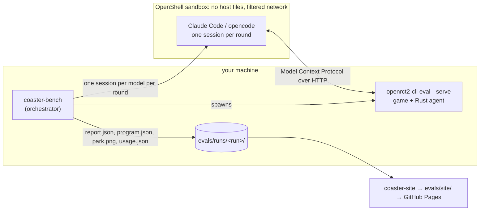
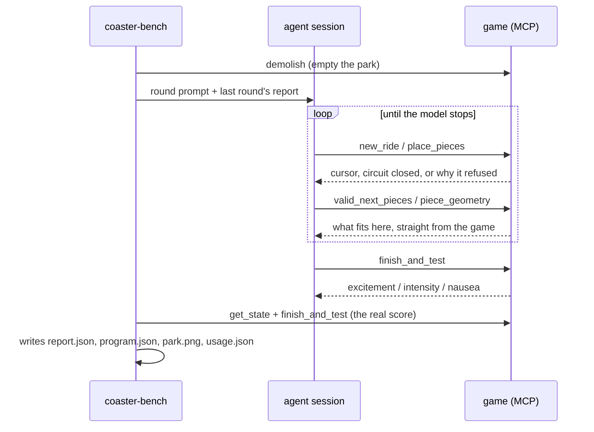

# CoasterBench

CoasterBench makes AI models build roller coasters. RollerCoaster Tycoon 2
scores them.

This repository forks [OpenRCT2](https://github.com/OpenRCT2/OpenRCT2) and adds
a Rust agent layer inside the game binary. A model connects to the running game,
places track pieces one at a time, and runs a real test train. The game returns
the excitement, intensity, and nausea ratings it computes itself.

Nothing simulates the score. No model judges another model. The oracle is a
20-year-old ratings function, and no one can argue their way past it.

See the results: **https://wseaton.github.io/CoasterBench**

## How the pieces fit together



The agent never reads your files and never touches the repository. It sees one
thing: the tools the game offers over the Model Context Protocol (MCP), the
open standard for connecting models to external tools.

Every change the agent makes goes through `GameActions::Execute`. The game's own
plugins use that same path. If the game would reject a track piece in the user
interface, it rejects the agent's piece too.

## What lives where

| Path | What it does |
| --- | --- |
| `rust/orct2-agent` | Links into the game binary. Serves MCP, runs track programs, names the pieces, reports ratings, scores similarity |
| `rust/coaster-bench` | Runs the competition. Starts the game, drives sandboxed agent sessions, collects each round |
| `rust/coaster-site` | Turns run records into a static website |
| `src/openrct2/rustbridge` | Connects the C++ game to the Rust crate |
| `src/openrct2/command_line/EvalCommands.cpp` | Adds the `eval` subcommand |
| `evals/driver.py` | A second harness. Calls the Anthropic API directly and takes whole track programs |
| `evals/runs/` | Run records. Git tracks the JSON; the heavy images live elsewhere |

Upstream OpenRCT2 owns everything else.

## Build it

Compiling needs no game data. Running does. Buy RollerCoaster Tycoon 2, then
extract the files with `innoextract` (from the GOG installer) or copy them from
RCT Classic.

```bash
cmake -S . -B build -G Ninja -DCMAKE_BUILD_TYPE=RelWithDebInfo
cmake --build build

# On macOS, point the binary at its data directory once:
ln -sf $PWD/build/OpenRCT2.app/Contents/Resources build/data
```

Check the Rust code, one crate at a time:

```bash
cd rust/orct2-agent && cargo fmt && cargo clippy --all-targets && cargo test
```

Corrosion compiles the agent crate as a static library and links it into the
binary. The `ENABLE_RUST_AGENT` flag turns it on, and it defaults to on. Change
any `#[no_mangle] extern "C"` item and you must regenerate the checked-in header:
run `./scripts/generate-rust-header.sh`.

## Run a competition

Six rounds, one model, steel twister coaster:

```bash
./rust/coaster-bench/target/release/coaster-bench \
  --models claude-sonnet-5 \
  --rounds 6 --ride-type 51 --name my-run
```

The model name picks the harness. A bare name runs Claude Code in the
`coaster-sub` sandbox. A name like `opencode:openrouter/<author>/<model>` runs
opencode in the `coaster-or` sandbox and calls OpenRouter.

Ride type 51 means a steel twister, which allows inversions. Ride type 52 means
a wooden coaster, which does not. Results land in
`evals/runs/<yyyymmdd>-<name>/<model>/round_N/`.

### One round, step by step



Every round starts with an empty park. Each round hands the model the previous
report, so it can learn and improve. A model's best round becomes its score.

### How scoring works

Excitement is the score, minus a copying penalty. CoasterBench compares each
track against RollerCoaster Tycoon 2's stock designs. It measures edit distance
and the longest shared run of pieces, and it checks mirrored versions too.

Similarity up to 0.5 costs nothing. Above 0.5, the score falls to zero in a
straight line:

```
score = excitement                                    if similarity <= 0.5
score = excitement * (1 - similarity) / (1 - 0.5)     otherwise
```

Copy a stock design and you score zero. Mirror it and you still score zero.
Each `run.json` records the threshold, so old runs keep the rules they ran under.

### The second harness

`evals/driver.py` tests something different. The model writes one complete track
program as JSON instead of building piece by piece. It runs two modes. In
`design` mode the model starts from nothing. In `library` mode it can search the
stock designs first, which tests how well it finds and adapts an existing layout.

```bash
uv run evals/driver.py --models claude-sonnet-5 --rounds 4 --mode library
```

## The MCP server

Start the game as a server, then connect your own session to it:

```bash
./build/openrct2-cli eval <scenario.SC6> --rct2-data-path ~/rct2-assets --serve 8791
claude mcp add --transport http coaster http://127.0.0.1:8791/mcp
```

You now hold the same tools the competitors hold, on a real park. Try it. You
will understand the difficulty faster than any description manages.

We wrote the server by hand in `rust/orct2-agent/src/mcp.rs`, and it runs on the
game thread on purpose. The game API accepts one thread only. So a tool call
runs game functions directly, and `run_ticks` advances the simulation in place.
No async runtime. No passing work between threads. The same input always gives
the same result.

| Tool | What it does |
| --- | --- |
| `new_ride` | Starts a ride and places the build cursor |
| `place_piece` / `place_pieces` | Adds one piece, or a batch that stops at the first refusal |
| `valid_next_pieces` | Asks the game which pieces fit right here |
| `piece_geometry` | Returns the exact cursor change for every piece from a direction |
| `undo_piece` / `demolish` | Removes the last piece, or the whole ride |
| `get_state` | Reports the cursor, the start, the piece count, and whether the circuit closes |
| `finish_and_test` | Adds the entrance and exit, runs a test train, returns the ratings |
| `screenshot` | Returns a picture of the park |
| `search_track_designs` / `get_track_design` | Browses the stock designs, and hides their recorded ratings |

`valid_next_pieces` and `piece_geometry` carry the interesting idea. Models do
not memorise the track geometry. They ask the game, and the game answers. Models
that ask before they build beat models that guess, by a wide margin.

### Cursor rules

Direction 0 faces -x, 1 faces +y, 2 faces +x, and 3 faces -y. The cursor moves
16 units per height step.

The cursor also carries bank and slope, not just position. Circuit closure
compares all of it. So a track that returns to the station while still banked or
sloped stays open, and the game says so.

### Modality gating

Each client says what content it can read, right in the request:

```
/mcp?modalities=text,image     # everything
/mcp?modalities=text           # the server hides screenshot and refuses it
/mcp                           # unspecified, so everything
```

The words come from OpenRouter's `input_modalities` field. A harness can pass a
model's declared abilities straight through. The server drops any tool that
answers outside the set, and refuses it if the model calls it anyway.

This matters more than it sounds. Send one image to a text-only model and the
whole request fails. So coaster-bench looks up each OpenRouter model, then builds
the URL and the prompt's tool list to match what that model reads.

## The website

```bash
cargo run --manifest-path rust/coaster-site/Cargo.toml   # writes evals/site/
```

The generator reads every `evals/runs/**/*.json` and writes a static site: an
index of all runs with one row per model, a page per run, and a page per model
per run. Each model page shows the track, the piece list, the ratings, and the
token and dollar cost. Unfinished runs stay hidden unless you pass
`--include-partial`.

Screenshots are large, so Git ignores them. Run `uv run evals/publish.py` to
upload them to a Cloudflare R2 bucket through your local `wrangler login`
session. No static keys live anywhere in the repository. The upload writes a
manifest next to the run.

The generator prefers local images and falls back to the manifest URLs, so a
continuous integration (CI) build works from JSON alone. **Commit both the run
JSON and the manifest.** Skip either one and the published site loses its images.

Push to the `eval` branch and touch `evals/` or `rust/coaster-site/`, and GitHub
Pages redeploys on its own.

## Continuous integration

Two workflows run, and both stay small:

- `coasterbench-ci.yml` checks formatting, runs Clippy, and runs the tests for
  all three Rust crates. It also builds the game and the command line tool on
  Linux, which proves the C++ and Rust halves still fit together.
- `coasterbench-site.yml` builds the results site and deploys it.

This fork deletes upstream's release, packaging, and translation workflows. We
rebase onto upstream `develop` often, so we keep our edits to existing OpenRCT2
files small and mechanical. Nearly all of our code sits in new directories.

## Licence

OpenRCT2 uses the GNU General Public License, version 3 or later, and so does
this fork. Read [`licence.txt`](licence.txt) for the terms. You still need your
own copy of the original RollerCoaster Tycoon 2 data files.

## Citation

Cite CoasterBench like this:

```bibtex
@misc{eaton2026coasterbench,
  title        = {CoasterBench: Scoring Agentic Design with a Twenty-Year-Old Game Engine},
  author       = {Eaton, Will},
  year         = {2026},
  howpublished = {\url{https://github.com/wseaton/CoasterBench}},
  note         = {An agentic benchmark where models build roller coasters
                  through RollerCoaster Tycoon 2's own construction API and
                  earn the ride ratings the game computes}
}
```
