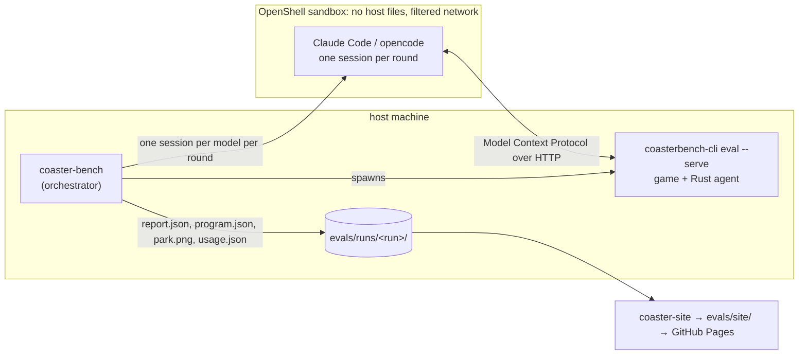
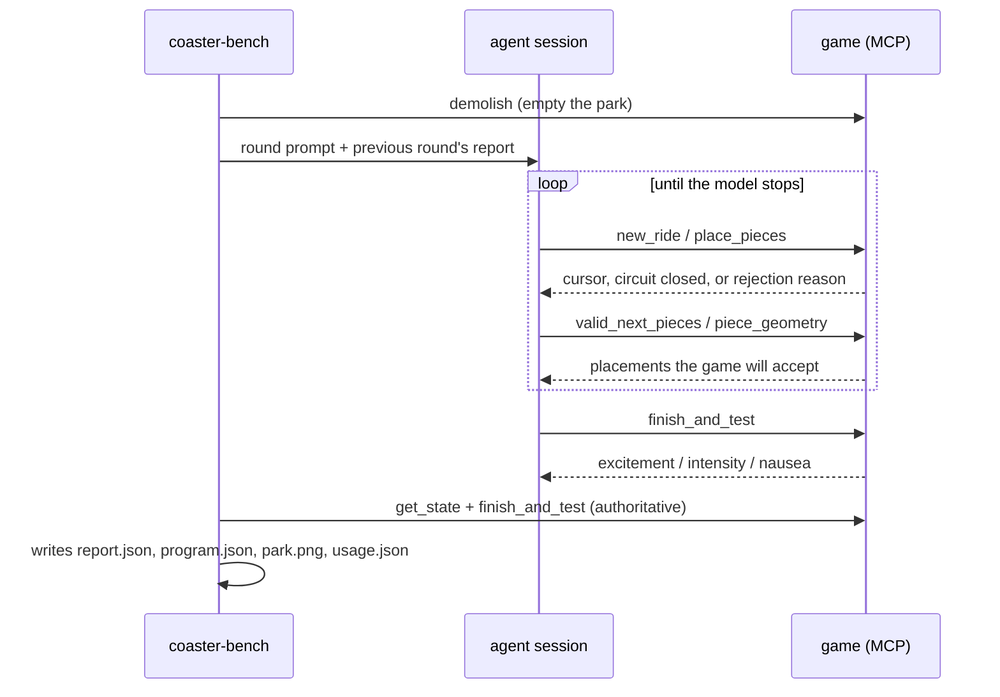

# CoasterBench

CoasterBench is a benchmark harness in which language models design roller
coasters inside RollerCoaster Tycoon 2. The game computes the score.

The repository is a fork of [OpenRCT2](https://github.com/OpenRCT2/OpenRCT2)
with a Rust agent layer linked into the game binary. A model connects to a
running game, places track pieces individually, and runs a test train. The
reported score is the excitement rating produced by the game's own ride ratings
function.

Published results: https://wseaton.github.io/CoasterBench

## Architecture



The agent has no host filesystem or repository access, and by default its only
interface is the tool set the game exposes over the Model Context Protocol
(MCP), an open standard for connecting models to external tools. The one
exception is open note (below), which stages a read-only copy of the upstream
engine source inside the sandbox. All state changes pass through
`GameActions::Execute`, the validation path used by the game's own plugins, so
the harness accepts the placements the game accepts, minus one class the game
accepts but cannot draw (see [Implementation notes](#implementation-notes)).

## Repository layout

| Path | Contents |
| --- | --- |
| `rust/orct2-agent` | Agent layer linked into the game binary: MCP server, track program executor, piece vocabulary, ratings report, similarity scoring |
| `rust/coaster-bench` | Orchestrator: starts the game, runs sandboxed agent sessions, collects per-round artifacts |
| `rust/coaster-site` | Static site generator for run records |
| `src/openrct2/rustbridge` | C++ side of the Rust bridge |
| `src/openrct2/command_line/EvalCommands.cpp` | The `eval` subcommand |
| `evals/driver.py` | Second harness: direct Anthropic API tool loop, whole-program submission |
| `evals/runs/` | Run records. Git tracks the JSON; images are published separately |

All other paths are unmodified upstream OpenRCT2.

## Requirements

The original RollerCoaster Tycoon 2 data files are required at runtime, not at
compile time. Extract them from the GOG installer with `innoextract`, or copy
them from an RCT Classic installation.

To reproduce a run end to end, follow
[docs/running-the-eval.md](docs/running-the-eval.md), which covers the same
material in dependency order, from buying the game to reading the report.

## Building

```bash
cmake -S . -B build -G Ninja -DCMAKE_BUILD_TYPE=RelWithDebInfo
cmake --build build

# macOS only: non-bundled binaries look for data/ next to the executable
ln -sf $PWD/build/OpenRCT2.app/Contents/Resources build/data
```

The command line tool is a modified `openrct2-cli` and builds as
`coasterbench-cli`; the cmake target keeps its upstream name. Prebuilt archives
are attached to [releases](https://github.com/wseaton/CoasterBench/releases),
tagged `v<harness>+openrct2-<upstream>` and carrying the binary, the OpenRCT2
runtime data and its libraries, but no RollerCoaster Tycoon 2 data.
`./scripts/package-release.sh` builds the same archive locally.

Corrosion compiles the agent crate as a static library and links it into the
binary. The `ENABLE_RUST_AGENT` option controls this and defaults to on.
Changing any `#[no_mangle] extern "C"` item requires regenerating the
checked-in header with `./scripts/generate-rust-header.sh`.

Per-crate checks:

```bash
cd rust/orct2-agent && cargo fmt && cargo clippy --all-targets && cargo test
```

## Running a benchmark

```bash
./rust/coaster-bench/target/release/coaster-bench \
  --models claude-sonnet-5 \
  --rounds 6 --ride-type 51 --name my-run
```

`--open-note` grants the white-box condition: a read-only checkout of the engine
source in the agent's sandbox (upstream OpenRCT2 at this fork's merge-base, so
the harness and its scoring are absent, but `RideRatings.cpp` is byte-identical
to the code that rates the ride), the file tools to read it, and `python3` for
working out geometry offline. Python has no network and cannot reach the game, so
park state stays knowable only through the MCP tools; `run.json` records the
granted `capabilities`. It is a modifier on either mode, and its scores are not
comparable with black-box ones, so the site labels and facets those runs
separately.

`--fresh-sandbox` creates a throwaway sandbox for the run from
`rust/coaster-bench/sandbox/` and deletes it afterwards. Without it the sandbox
is long-lived, and an agent's own notes (Claude Code's memory directory is
writable even under a tool allowlist) become the next run's starting knowledge.

The model specification selects the harness. A bare name runs Claude Code in the
`coaster-sub` sandbox; `opencode:openrouter/<author>/<model>` runs opencode in
the `coaster-or` sandbox against OpenRouter. Ride type 51 is a steel twister,
which permits inversions; ride type 52 is a wooden coaster, which does not.
Artifacts are written to `evals/runs/<yyyymmdd>-<name>/<model>/round_N/`.

### Round sequence



Each round starts from an empty park and receives the previous round's report as
feedback. A model's highest-scoring round is its score for the run.

### Scoring

The score is excitement, reduced by a similarity penalty. Each track is compared
against the stock RollerCoaster Tycoon 2 design library using edit distance and
longest common substring, including mirrored variants. Similarity at or below
0.5 incurs no penalty; above 0.5 the score scales linearly to zero.

```
score = excitement                                    if similarity <= 0.5
score = excitement * (1 - similarity) / (1 - 0.5)     otherwise
```

A copied or mirrored stock design therefore scores zero. Each `run.json` records
the threshold used, so earlier runs render under the rules they were scored
with.

### Alternative harness

`evals/driver.py` submits one complete track program as JSON instead of building
incrementally. It supports two modes: `design`, which starts from nothing, and
`library`, which permits searching the stock designs first and measures
retrieval and adaptation.

```bash
uv run evals/driver.py --models claude-sonnet-5 --rounds 4 --mode library
```

## MCP server

```bash
./build/coasterbench-cli eval <scenario.SC6> --rct2-data-path ~/rct2-assets --serve 8791
claude mcp add --transport http coaster http://127.0.0.1:8791/mcp
```

This exposes the benchmark tool set to an interactive session against a loaded
park.

The server is implemented directly in `rust/orct2-agent/src/mcp.rs` and runs on
the game thread, because the game API is single-threaded. A tool call invokes
game functions directly and `run_ticks` advances the simulation inline, with no
async runtime and no cross-thread marshaling. It implements the streamable-HTTP
JSON response mode with `initialize`, `tools/list`, and `tools/call`.

| Tool | Behaviour |
| --- | --- |
| `new_ride` | Creates a ride and sets the build cursor |
| `place_piece` / `place_pieces` | Places one piece, or a batch that halts at the first rejection |
| `valid_next_pieces` | Returns the catalog pieces the game accepts at the current cursor |
| `piece_geometry` | Returns the exact cursor delta for every piece from a given direction |
| `undo_piece` / `demolish` | Removes the last piece, or the entire ride |
| `get_state` | Returns cursor, start, piece count, and circuit closure |
| `finish_and_test` | Places entrance and exit, runs a test train, returns ratings |
| `screenshot` | Returns a park image |
| `search_track_designs` / `get_track_design` | Browses the stock .TD6 library; recorded ratings are withheld |

`valid_next_pieces` and `piece_geometry` make the game the authority on track
geometry, so models query placement rules rather than recalling them.

### Cursor semantics

Direction 0 faces -x, 1 faces +y, 2 faces +x, 3 faces -y. The cursor z step is
16. The cursor carries bank and slope in addition to position, and circuit
closure compares all components, so a track returning to the station while
banked or sloped is treated as open.

### Modality gating

Clients declare the content types they accept in the request target:

```
/mcp?modalities=text,image     # all tools
/mcp?modalities=text           # screenshot hidden and refused
/mcp                           # unspecified: all tools
```

The vocabulary matches OpenRouter's `input_modalities` field, allowing a harness
to forward a model's declared capabilities unchanged. Tools answering outside
the declared set are omitted from `tools/list` and rejected on call. This is
required because an image content block sent to a text-only model fails the
entire request; coaster-bench resolves each OpenRouter model against the
catalogue and constructs both the URL and the prompt's tool list accordingly.

## Site generation

```bash
cargo run --manifest-path rust/coaster-site/Cargo.toml   # writes evals/site/
```

The generator reads `evals/runs/**/*.json` and produces an index of all runs
with one row per model, a page per run, and a page per model per run containing
the track, piece list, ratings, and token and cost totals. Incomplete runs are
skipped unless `--include-partial` is passed.

Screenshots are excluded from Git. `uv run evals/publish.py` uploads them to a
Cloudflare R2 bucket through the local `wrangler login` session, so no static
credentials are stored in the repository, and writes a manifest alongside the
run. The generator prefers local images and falls back to manifest URLs, which
allows a continuous integration (CI) build to work from JSON alone. Both the run
JSON and the manifest must be committed; otherwise the published site renders
without images.

Pushes to the `eval` branch touching `evals/` or `rust/coaster-site/` trigger a
GitHub Pages deployment.

## Continuous integration

`coasterbench-ci.yml` runs formatting, Clippy, and tests for all three Rust
crates, then builds the game and command line tool on Linux to verify the C++
and Rust components still link. `coasterbench-site.yml` builds and deploys the
results site.

Upstream's release, packaging, and translation workflows are removed in this
fork. The fork rebases onto upstream `develop` regularly, so modifications to
existing OpenRCT2 files are kept minimal and mechanical, with new code in
separate directories.

## Implementation notes

### Pieces that place, test, and rate, but do not render

**Symptom.** Park screenshots showed long stretches of coaster missing: no
track, no supports, terrain where a ride had just been rated. The ride was
continuous by every measure the game reports, and the gaps changed with view
rotation.

**Investigation.** Instrumenting the paint path ruled out the renderer: every
track tile was visited and painted, every created paint struct was drawn (1166
of 1166, none lost in quadrant sorting), and disabling creation-time culling
changed nothing. 32 tiles had their paint function called and emitted nothing.
Sixteen were expected, being the empty filler sequences of banked five-tile
turns and large helices. The remaining sixteen matched the program's sixteen
one-tile flat↔60° transitions on a wooden coaster.

**Cause.** RCT2 only ever drew the three-tile long-base steep transitions for
wooden coasters, so the wooden paint dispatch has no case for the one-tile
versions and returns `TrackPaintFunctionDummy`, which draws nothing. The ride
type descriptor agrees: `flatToSteepSlope` is not among its track groups, so the
construction window never offers those pieces. That gate feeds only the window.
`TrackPlaceAction` does not consult it, so programmatic placement succeeds, and
ratings compute normally because they read the track element descriptor rather
than the artwork. The same path is reachable without this harness: the
ride-type-change cheat rewrites every piece's ride type with no drawability
check, and plugins call the same unchecked action.

**Fix.** The harness queries the renderer's own dispatch for drawability before
placing or offering a piece, so a request for an undrawable piece is rejected
with a reason instead of producing an invisible ride. Details in
[issue #1](https://github.com/wseaton/CoasterBench/issues/1).

Validation, simulation, and rendering are three separate authorities in RCT2 and
they do not agree, so "the game accepted it" is not on its own sufficient
evidence that a track is well formed.

## Licence

OpenRCT2, and therefore this fork, is licensed under the GNU General Public
License version 3 or later. See [`licence.txt`](licence.txt). A legitimate copy
of the original RollerCoaster Tycoon 2 data files is required.

The run records under `evals/runs/` and the text of this repository are
© 2026 Will Eaton, licensed [CC BY 4.0](https://creativecommons.org/licenses/by/4.0/),
so results can be cited and replotted with attribution.

Park screenshots depict RollerCoaster Tycoon 2, © Chris Sawyer and Atari, and
are published to document benchmark results. This project is not affiliated
with, endorsed by, or a release of either Atari or OpenRCT2.

## Citation

```bibtex
@misc{eaton2026coasterbench,
  title        = {CoasterBench: An Agentic Coaster Design Benchmark Scored by
                  RollerCoaster Tycoon 2},
  author       = {Eaton, Will},
  year         = {2026},
  howpublished = {\url{https://github.com/wseaton/CoasterBench}}
}
```
